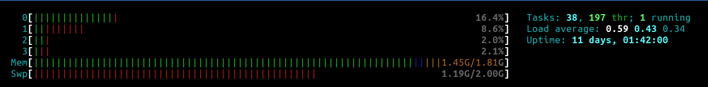

<div align="center">


[](https://github.com/beep-projects/SuricataPi/blob/main/LICENSE) [](https://github.com/beep-projects/SuricataPi/actions/workflows/shellcheck.yml) [](https://github.com/beep-projects/SuricataPi/issues) [](https://github.com/beep-projects/SuricataPi/network) [](https://github.com/beep-projects/SuricataPi/stargazers) 

</div>

**SuricataPi** hosts scripts to setup a Raspberry Pi as **intrusion detection system** (IDS) for **home networks** based on [Suricata](https://suricata.io/) and [ELK stack](https://www.elastic.co/what-is/elk-stack). The configured system collects **Suricata** [eve.json](https://suricata.readthedocs.io/en/latest/output/eve/eve-json-output.html) logs and feeds them into the **ELK stack** for analysis. The available data includes alerts, flows, http, dns, statistics and other log types, which you can easily access to create your own dashboards.

The basic configuration of this project can be done in 5 minutes, while the automated setup might take between 20 and 60 minutes. The used tools get frequent updates, which might break our scripts. Therefore, please keep in mind that this project might need some more work on your side. If you run into issues with the scripts, check the [open issues](https://github.com/beep-projects/SuricataPi/issues/) and open a new issue if your problem is not already listed.

This project was inspired by (outdated) projects like [SELKS](https://github.com/StamusNetworks/SELKS) and [sýnesis lite](https://github.com/robcowart/synesis_lite_suricata).


## Contents
- [Requirements](#requirements)
- [Setup](#setup)
- [Directory Structure of this Project](#directory-structure-of-this-project)
- [Install](#install)
- [Update](#update)
- [Dashboard Gallery](#dashboard-gallery)
- [Details](resources/details.md)
- [Contribute](CONTRIBUTING.md)

## Requirements
<span style="font-weight:normal;font-size:small">\[[Back to Contents](#contents)\]</span>

This project is developed for **Raspberry Pi 4**, which is hard to get at the moment. In addition to that, you also need a **network switch** that supports **port mirroring**.
The hardware that I used for this project is:

- Raspberry Pi 4 Model B Rev 1.5, 2GB RAM
- SANDISK Extreme PRO® UHS-I, Micro-SDXC, 32 GB
- TP-Link TL-SG105E, 5-Port-Gigabit-Unmanaged Pro Switch  

Currently, the project is optimized to run on my setup, but I will happily optimize it, to run also fine on other systems.
If you get hold of a **Raspberry Pi 4** with more RAM than 2GB, you should adapt the lines following `# limit elasticsearch heap size` in [secondrun.sh](scripts/secondrun.sh) to increase the heap size for elastic search.

`htop` shows that 2GB are actually not enough for **SuricataPi**, but with some swapping the system runs fine.
<center></center>

## Setup
<span style="font-weight:normal;font-size:small">\[[Back to Contents](#contents)\]</span>

In order to give **SuricataPi** access to all the traffic in your home network, you have to run all the traffic though a switch with **port mirroring**, that duplicates all the traffic to the configured **mirror port**. If you want to enable **SuricataPi** to also monitor the traffic in you home WiFi, you will not be able to use the WiFi router connecting to your ISP, as this usually does not route the traffic to the wired network, where **SuricataPi** can be connected. You will have to disable the ISP routers WiFi and add an access point to your network which is connected to the switch.

<div align="center" style="background-color:white; padding:10px"></div>

## Directory Structure of this Project
<span style="font-weight:normal;font-size:small">\[[Back to Contents](#contents)\]</span>
```
SuricataPi
├── .github/workflows                   # actions for verifying/testing commits
├── resources                           # folder for files used for README.md
└── scripts                             # folder holding the files that are copied to the Raspberry Pi OS sd card 
    ├── 10-suricata.conf                # configuration file for logstash
    ├── cmdline.txt                     # this file controls which file is run at boot of raspberry pi
    ├── firstrun.sh                     # script to do basic configuration of the raspberry pi
    ├── secondrun.sh                    # actual setup script of SuricataPi
    ├── SuricataPi.ndjson               # Kibana objects for dashboards
    ├── suricatapi-index-template.json  # index template for Elasticsearch
    ├── suricatapi-index-policy.json    # index policy for Elasticsearch
    └── thirdrun.sh                     # cleanup script
├── CONTRIBUTING.md
├── LICENSE
├── README.md
├── getAndConfigureSuricataPi.sh        # script to configure and start the installation
└── install_suricatapi.sh               # script to download Raspberry Pi OS and configure it as SuricataPi
```

## Install
<span style="font-weight:normal;font-size:small">\[[Back to Contents](#contents)\]</span>

For installation on **Windows**, I will only give support on specific request. If you read through [install_suricatapi.sh](install_suricatapi.sh) you should be able to identify the needed steps. If you can't do this, I doubt that **SuricataPi** will be of any use for you. Sorry!  

For installation on **Linux** I provide a script that downloads Raspberry Pi OS and flashes it onto a Micro SD card. The script was mainly written out of curiosity to see how that could work. So it has no added sanity checks and you should use it with care. Check each step, when asked to confirm.  
On Linux you can do the following steps

1. Insert the Micro SD card that you want to get prepared as **SuricataPi** into your notebook/PC/whatever

2. Run the following commands in your shell
   ```bash
   wget https://github.com/beep-projects/SuricataPi/releases/latest/download/getAndConfigureSuricataPi.sh
   chmod 755 getAndConfigureSuricataPi.sh
   ./getAndConfigureSuricataPi.sh
   ```
The next steps in these instructions assume that your user is ```beep``` with password ```projects``` and the configured hostname is ```suricatapi```. If you use different values, don't do plain copy & paste.

3. Eject the Micro SD card and insert it into your Raspberry Pi

4. Connect the Raspberry Pi with an Ethernet cable to the mirror port of your switch

5. Power up the Raspberry Pi

6. Wait a while (~10-45 minutes, depending on the number of system updates available) 
   For troubleshooting, you can check the progress by checking the logs. After 5 minutes the resize of the partitions and ```firstrun.sh``` should be finished, so that you can ```ssh``` into the **SuricataPi** and watch the installation process

   ```bash
   ssh -x beep@suricatapi
   tail -f /boot/secondrun.log
   ```
   
7. Open [http://suricatapi:5601/app/dashboards#/view/376f9900-a274-11ed-a4f0-6112efb73001](http://suricatapi:5601/app/dashboards#/view/376f9900-a274-11ed-a4f0-6112efb73001) in your browser

8. **SuricataPi** only provides some basic configuration for **Suricata** and the **ELK stack**, if you want to start to adjust the setup to your needs, you should take a look at the [details.md](resources/details.md).

9. For simplicity and because **SuricataPi** is intended to be run in a **home network** as single node, all security features are disabled; especially encryption and TLS. If you want to use your **SuricataPi** in a non trusted environment, you should reenable these features. See [Set up minimal security for Elasticsearch](https://www.elastic.co/guide/en/elasticsearch/reference/current/security-minimal-setup.html).
   You also should change the password for the **built-in superuser**. **Elasticsearch** prints this during the installation process, so it ends up in ```/boot/secondrun.log```. You can obtain it from there by running ```sed -n 's/^.*generated password.* : \(.*\)/\1/p' /boot/secondrun.log``` on the **SuricataPi** console. You should change this password asap and remove the logfile, if you want to increase security of your installation. 

## Update
<span style="font-weight:normal;font-size:small">\[[Back to Contents](#contents)\]</span>

**SuricataPi** is only setting up the system, from that time on **you** are the **maintainer** of the system and should keep it up to date.

If you don't know how to do this, start with reading [Updating and Upgrading Raspberry Pi OS](https://www.raspberrypi.com/documentation/computers/os.html#updating-and-upgrading-raspberry-pi-os).

## Dashboard Gallery
<span style="font-weight:normal;font-size:small">\[[Back to Contents](#contents)\]</span>

SuricataPi has some dashboards preloaded into **Kibana**.

**SuricataPi: Overview**


**SuricataPi: Alert Overview**


**SuricataPi: Attacker Overview**


**SuricataPi: Alert Log**


**SuricataPi: Stats**

