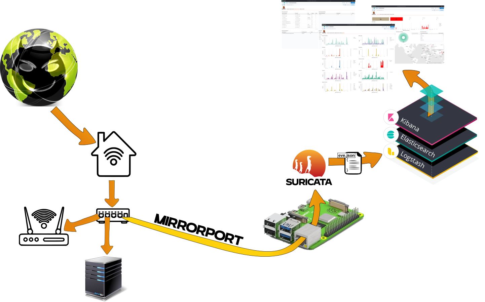

     

This projects hosts scripts to setup a Raspberry Pi as intrusion detection system (IDS) for home networks based on [Suricata](https://suricata.io/) and [ELK stack](https://www.elastic.co/what-is/elk-stack). The configured system collects Suricata [eve.json](https://suricata.readthedocs.io/en/latest/output/eve/eve-json-output.html) logs and feeds them into the ELK stack for analysis. This data includes alerts, flows, http, dns, statistics and other log types, which you can easily access to create your own dashboards. This project was inspired by (outdated) projects like [SELKS](https://github.com/StamusNetworks/SELKS) and [sýnesis lite](https://github.com/robcowart/synesis_lite_suricata).

Required Hardware

Raspberry Pi 4 Model B Rev 1.5, 2GB RAM

