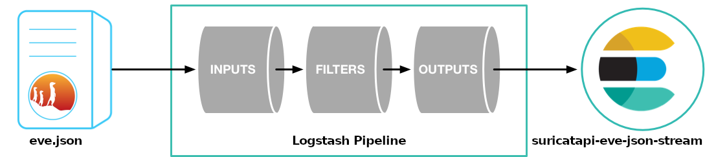

# Details
<sup>\[[Back to README.md](../README.md)\]<sup>

This page shall give you some additional information on the configuration of **SuricataPi**, and help you to start customizing it. If you have created something new and cool, please [contribute](../CONTRIBUTING.md) your change.
## Contents
- [General](#general)
- [Suricata](#suricata)
- [Logstash](#logstash)
- [Elastic Stack](#elastic-stack)
- [Logstash](#logstash)
- [Elasticsearch](#elasticsearch)
- [Kibana](#kibana)

## General
If you want to modify the **SuricataPi**, a good start is to read the standard guides of the tools used.
- Suricata: [Suricata: Configuration](https://suricata.readthedocs.io/en/latest/configuration/)
- Elastic Stack: [Secure the Elastic Stack](https://www.elastic.co/guide/en/elasticsearch/reference/current/secure-cluster.html)
- Logstash: [Getting Started with Logstash](https://www.elastic.co/guide/en/logstash/current/getting-started-with-logstash.html)
- Elasticsearch: [Configuring Elasticsearch](https://www.elastic.co/guide/en/elasticsearch/reference/current/settings.html)
- Kibana: [Kibana Dashboard](https://www.elastic.co/kibana/kibana-dashboard)

<center></center>

## Suricata
<sup>\[[Back to Contents](#contents)\]<sup>

Most likely you might want to customize the loaded rules for Suricata. SuricataPi has only enabled some of the freely available rules. You can get the list of the freely available rules by calling:
 ```
 suricata-update list-sources --free
 ```
To get a list of all enabled rules, call:
```bash
suricata-update list-sources --enabled
...
Enabled sources:
  - ptresearch/attackdetection
  - etnetera/aggressive
  - et/open

```
To enable additional rules, call: 
```
sudo suricata-update enable-source <SOURCENAME>
```

Suricata is configured to write its output as [Eve JSON Output](https://suricata.readthedocs.io/en/latest/output/eve/eve-json-output.html#eve-json-output) to ```/var/log/suricata/eve.json```. The next stage in the pipeline is [logstash](https://www.elastic.co/logstash/)

## Logstash
<sup>\[[Back to Contents](#contents)\]<sup>

The configuration for **Logstash** is done in ```/etc/logstash/conf.d/10-suricata.conf```. The **Logstash** configuration has three blocks: Input -> Filter -> Output. 
<center></center>

You most likely will not need to touch the Input and Output blocks, but might want to add filters to create additional data for your analysis or dashboards. You will find helpful information in [Creating a Logstash pipeline](https://www.elastic.co/guide/en/logstash/current/configuration.html) and [Filter plugins](https://www.elastic.co/guide/en/logstash/current/filter-plugins.html).

The output of **Logstash** is loaded into the elasticsearch data stream ```suricatapi-eve-json-stream```.

## Elasticsearch
<sup>\[[Back to Contents](#contents)\]<sup>

There is not much that **SuricataPi** configures for Elasticsearch. The default configuration is good enough. The only configuration done to Elasticsearch is:

limiting the Java heap size in 
```bash
/etc/elasticsearch/jvm.options.d/suricatapi.options
-Xms256m
-Xmx256m
``` 
and disabling the security features in 
```bash
/etc/elasticsearch/elasticsearch.yml
xpack.security.enabled: false
#xpack.security.enrollment.enabled: false
#xpack.security.http.ssl:
#  enabled: false
#xpack.security.transport.ssl:
#  enabled: false
```
If you want to change other settings for Elasticsearch, a good guide can be found here [Configuring Elasticsearch](https://www.elastic.co/guide/en/elasticsearch/reference/current/settings.html).
On top of Elasticsearch, Kibana is running for delivering the dashboards.

## Kibana
<sup>\[[Back to Contents](#contents)\]<sup>

For **Kibana**, also the default configuration is good enough for **SuricataPi**. If you want to optimize anything here for whatever reason, see [Configure Kibana](https://www.elastic.co/guide/en/kibana/current/settings.html).
**SuricataPi** loads preconfigured dashboards into **Kibana**, which you can access via [http://suricatapi:5601/app/dashboards](http://suricatapi:5601/app/dashboards).
The available elements to build your own dashboards on are
- ```suricatapi-eve-json-stream```, the **data stream** which receives the ```eve.json``` data from **Logstash**
- ```suricatapi-index-template```, an **index template**, which maps the geoip.location contained in ```suricatapi-eve-json-stream``` as geo_point, so **Kibana** can use it
- ```suricatapi-index-policy```, an **index lifecycle policy**, which manages the lifecycle of the ```suricatapi-eve-json-stream``` data stream. By default it is configured to create every day a new backing index and to delete a backing index if it is older than 14 days
- ```SuricatPi: Logstash Index```, the **data view** which finally gives your dashboards access to the data from  ```suricatapi-eve-json-stream```

For starting to create your own dashboards, a good read is [Dashboard and visualizations](https://www.elastic.co/guide/en/kibana/current/dashboard.html). If you have created nice dashboards, please export your work following [Manage saved objects](https://www.elastic.co/guide/en/kibana/current/managing-saved-objects.html) and [contribute](../CONTRIBUTING.md) them to **SuricataPi**.

<sup>\[[Back to README](../README.md)\] \[[Back to top](#details)\]<sup>